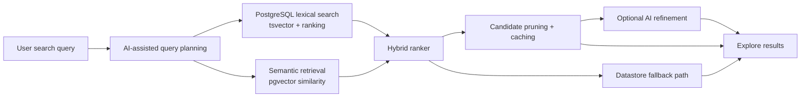
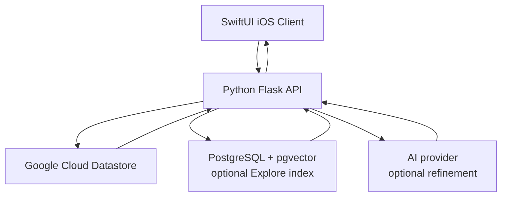

# Acorn

Acorn is a UC Davis campus activities platform built by a three-person student team. The product combined campus event discovery, user/community features, scheduling workflows, and AI-assisted search through a SwiftUI iOS client and a Python Flask backend.

The original project source is private to the team. This repository summarizes the system design and backend work without including application source code or runtime credentials.

## Summary

My work focused on Acorn's core AI-powered Explore search and recommendation system, including backend APIs, search infrastructure, testing, debugging, and reliability work.

My most important contribution was the backend hybrid search system behind Explore. It was designed to retrieve high-quality candidate events before AI refinement, reduce search latency, and keep the product usable even when optional AI or search infrastructure was unavailable.

The backend work centered on:

- most backend API definitions and service implementations
- AI-powered Explore search and recommendation
- PostgreSQL hybrid search combining lexical search with semantic retrieval
- backend caching and input pruning that reduced end-to-end AI search latency from roughly 60 seconds to under 10 seconds
- backend loading performance optimization through local cache, tiered image/description loading, segmented event loading, and partial-load tolerance under unstable conditions
- automated pytest benchmarking across 30+ diverse search payloads
- fail-soft fallback behavior through local Datastore paths during provider or infrastructure outages

For event-loading performance, no formal statistical study was run. Based on repeated end-to-end testing and day-to-day usage, load behavior shifted from occasional very long waits to near-instant display in most normal cases.

## Key Contribution: Hybrid Explore Search

The Explore search system used a layered retrieval pipeline:



### What the system did

- Built a denormalized Explore search document for each event/post so search could run against compact, query-ready records.
- Combined PostgreSQL full-text search with semantic vector similarity to catch both exact keyword matches and intent-level matches.
- Used `tsvector` ranking for lexical relevance and `pgvector` similarity for semantic relevance.
- Added time, location, and deletion filters so retrieval matched product behavior instead of returning generic text-search results.
- Added backend caching and candidate pruning to reduce the amount of data sent into slower AI refinement paths.
- Kept a local Datastore fallback path so search remained functional if PostgreSQL search, vector search, or AI services were unavailable.
- Added scripts and tests for index synchronization, search behavior, fallback behavior, and latency validation.

### Why it mattered

Model response time wasn't the main bottleneck. The system first needed to find a small, relevant set of candidate events from campus data. Without a retrieval layer, the AI path had too much noisy input and could take about a minute end to end.

The hybrid search layer made the backend responsible for narrowing the search space before AI refinement. That changed the product behavior from slow, broad AI filtering to a more reliable retrieval-first system, bringing practical search latency under 10 seconds in the tested workflow.

## Backend Scope

The backend was built around Python Flask APIs with Google Cloud Datastore as the primary application datastore. PostgreSQL/pgvector was introduced as optional search infrastructure for the Explore retrieval path.

Backend areas I worked on included:

- Explore search and recommendation APIs
- PostgreSQL-backed hybrid search index
- Datastore fallback retrieval paths
- Event and post data flows
- AI-assisted search planning and result refinement
- Backend caching for repeated or expensive search operations
- Search index synchronization and backfill tooling
- Automated testing and benchmarking for search behavior
- Local debugging and server setup documentation

## System Architecture



The important design choice was that PostgreSQL search and AI refinement were optional acceleration layers. If they were unavailable, the backend could still return results from Datastore-backed paths.

## Reliability And Testing

The search system was built with failure handling in mind:

- Search infrastructure could be disabled through configuration.
- Missing PostgreSQL or `pgvector` dependencies did not prevent the backend from running.
- Query failures fell back to local Datastore retrieval.
- Automated tests covered search document construction, index behavior, fallback behavior, and sync tooling.
- Benchmarking scripts exercised 30+ diverse search payloads to check responsiveness across realistic query types.

## Repository Contents

```text
Acorn-Case-Study/
|- README.md
|- docs/
|  |- architecture.md
|  |- backend.md
|  |- ios.md
|  `- selected-contributions.md
```
