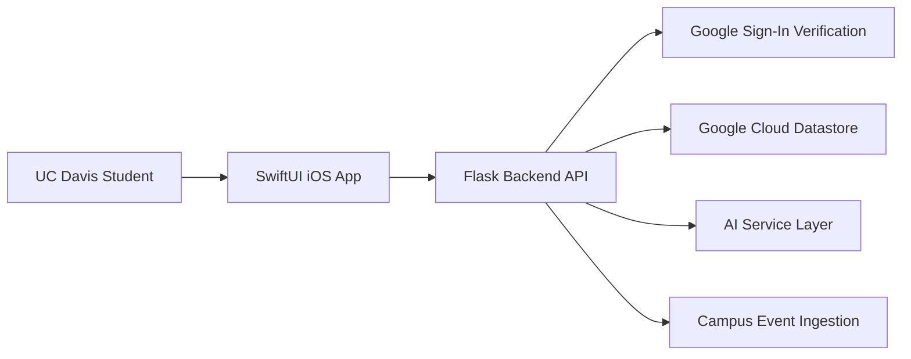

# Architecture

Acorn is organized as a mobile client plus backend service.

## High-Level Flow

## Main Components

| Area | Responsibility |
| --- | --- |
| iOS app | Authentication, onboarding, event discovery, profile, communities, scheduling, and local UI state |
| Backend API | Auth, profile, follows, explore feed, communities, Time2Meet, media, posters, seed jobs, and AI endpoints |
| Storage | User data, sessions, events, follows, community membership, meeting notes, and poster/event metadata |
| AI layer | Guided search, event description generation, flyer-related text workflows, and meeting-note summaries |
| Ingestion | Campus event seed/sync jobs from UC Davis-related sources |

## Engineering Challenges

- Keeping iOS state consistent across search, bookmarks, swipe actions, and detail screens
- Handling server-side authentication with Google ID tokens and app-issued sessions
- Maintaining feature velocity while backend storage models changed
- Supporting both local development and cloud deployment
- Making AI features useful inside concrete product flows instead of leaving them as generic chat
